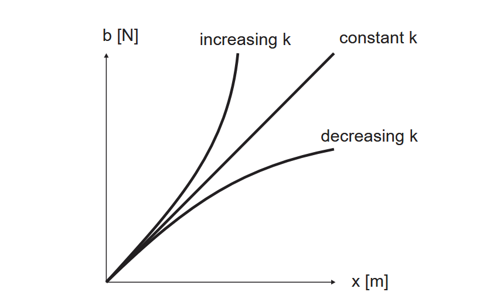
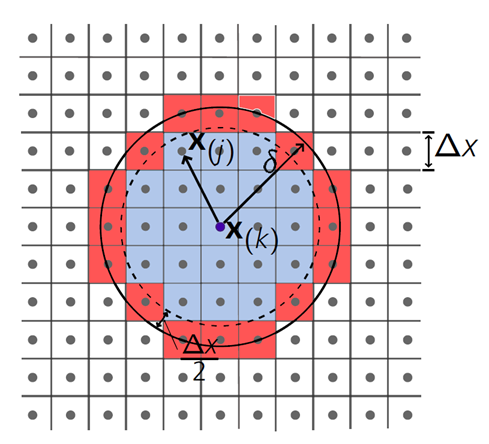

## Seminar 2: Material point method and solver
- particle method
- points are grid fix (no pure mesh free method)

**Advantage**
- no topology
- disconnection of points is easy


**Disadvantage**
- convergence is low
- gradients purely described by points

## Equations in the Quasi-Static Material Point Method Algorithm

#### **1. Mapping Material Point Quantities to Grid Nodes**

- **Nodal Mass**

$$
M_{\text{node}} = \sum_{mp} m_{mp} \, N_{mp-nd}
$$

- **Nodal Velocity**

$$
\mathbf{V}_{\text{node}} = \frac{1}{M_{\text{node}}} \sum_{mp} \mathbf{P}_{mp} \, N_{mp-nd}
$$

- **Internal Force Vector**

$$
\mathbf{F}_{\text{node}}^{\text{internal}} = \sum_{mp} \boldsymbol{\sigma}_{mp} \, \nabla N_{mp-nd}
$$

- **External Force Vector**

$$
\mathbf{F}_{\text{node}}^{\text{external}} = \sum_{mp} \mathbf{b} \, N_{mp-nd}
$$

#### **2. Solving Equations of Motion on the Grid**

- **Nodal Acceleration**

$$
\mathbf{A}_{\text{node}} = \frac{\mathbf{F}_{\text{node}}^{\text{external}} + \mathbf{F}_{\text{node}}^{\text{internal}}}{M_{\text{node}}}
$$

- **Updated Nodal Velocity**

$$
\tilde{\mathbf{V}}_{\text{node}} = \mathbf{V}_{\text{node}} + \mathbf{A}_{\text{node}} \, \mathrm{d}t
$$

#### **3. Mapping Back to Material Points**

- **Material Point Acceleration**

$$
\mathbf{a}_{mp} = \sum_{nd} \mathbf{A}_{\text{node}} \, N_{nd-mp}
$$

- **Strain Rate (Infinitesimal Strain Theory)**

$$
\dot{\boldsymbol{\varepsilon}}_{mp} = \sum_{nd} \frac{1}{2} \left[ \mathbf{V}_{\text{node}} \nabla N_{nd-mp} + (\mathbf{V}_{\text{node}} \nabla N_{nd-mp})^T \right]
$$



Figure taken from [BeuthL2012](@cite).


---

$$\rho \ddot{u}_i = \frac{1}{2}\sum_j (f_{ji}V_i-f_{ij}V_j)+b_i$$

$$F_i + b_i=\rho\ddot{u}_i$$


**Static case**


Figure taken from [BeuthL2012](@cite).


$\mathbf{F}(\mathbf{u}_{i+1}) + \mathbf{b}_{i+1} \rightarrow 0$


---


**Verlet time integration**

$$\mathbf{u}_{i+1} = \mathbf{u}_{i} + \Delta t\dot{\mathbf{u}}_{i} + \frac12 \Delta t^2\ddot{\mathbf{u}}_{i}$$

with

$$\ddot{\mathbf{u}}_{i} = \frac{\mathbf{F}_i}{\rho}$$

where $\rho$ is the mass density of the point and $\mathbf{F}_i=\mathbf{F}_{external}-\mathbf{F}_{internal}$ for the current time step.

For parabolic  time integration as in temperature models the following schema is used

$$\boldsymbol{\tau}_{i+1} =  \boldsymbol{\tau}_i - \Delta t \frac{\mathbf{H}}{\rho C_v}$$

where $\rho$ is the mass density, $C_v$ is the [specific heat capacity](https://en.wikipedia.org/wiki/Specific_heat_capacity) and $\mathbf{H}$ is the heat flux of each point [OterkusS2014b](@cite).

For the time intergration a stable increment has to be determined.


# Volume correction


$$\lambda_{corr}=\frac{2V_0}{V(\mathbf{x})+V(\mathbf{x}')}$$

The reference volumen $V_0$ is depended on the dimension (3D or 2D)

$$V_{0-3D}=\frac{4\pi\delta^3}{3}$$

$$V_{0-2D}=\frac{\pi\delta^2h}{4}$$

this factor is than multiplied to the bond force
$$\mathbf{t}_{corr} =\lambda_{corr}\mathbf{t}$$

!!! warn "Only mechanical"
    Surface correction is right now only applied for mechanical properties.

You can apply the surface correction initialy for all outer surfaces and continuous, for cracks or additive manufacturing.


```julia
using Plots
using Polynomials

# Definition des Intervalls
x = range(0, π, length=200)
y = sin.(x)

# Plot vorbereiten
plot(x, y,
    label="sin(x)",
    lw=2,
    legend=:bottomleft,
    xlabel="x",
    ylabel="y",
    size=(1200, 800))

# Anzahl der Stützstellen
n_nodes = 8
x_nodes = range(0, π, length=n_nodes)
y_nodes = sin.(x_nodes)

# Approximation mit Polynomen 2. bis 7. Ordnung
for deg in 1:3
    # Polynomanpassung
    p = fit(x_nodes, y_nodes, deg)
    y_approx = p.(x)
    plot!(x, y_approx, label="Grad $deg")
end

# Punkte anzeigen
scatter!(x_nodes, y_nodes, label="Exact solution", color=:black)
```

---

## Set up your own model

```plaintext
header: x y block_id volume
0 0 1 1
1 0 1 1
2 0 1 1
3 0 1 1
4 0 1 1
```

```julia
function generate_grid_fixed_spacing(filename, x_from, x_to, y_from, y_to, dx; block_id=1)

    num_points_x = Int(floor((x_to - x_from) / dx)) + 1
    num_points_y = Int(floor((y_to - y_from) / dx)) + 1
    volume = dx * dx

    open(filename, "w") do io
        println(io, "header: x y block_id volume")
        for j in 0:num_points_y-1
            y = y_from + j * dx
            for i in 0:num_points_x-1
                x = x_from + i * dx
                println(io, "$(x) $(y) $(block_id) $(volume)")
            end
        end
    end
end
```


```yaml
PeriLab:
  Discretization:
    Node Sets:
      Node Set 1: 1
      Node Set 2: 5
    Type: "Text File"
    Input Mesh File: "truss.txt"
  Models:
    Material Models:
      Test:
        Material Model: "Bond-based Elastic"
        Symmetry: "isotropic plane stress"
        Young's Modulus: 7000
        Poisson's Ratio: 0.3
  Blocks:
    block_1:
      Block ID: 1
      Material Model: "Test"
      Density: 2e-9
      Horizon: 2
  Boundary Conditions:
    BC_1:
      Variable: "Displacements"
      Node Set: "Node Set 1"
      Coordinate: "x"
      Value: "100*t"
      Type: Dirichlet
    BC_2:
      Variable: "Displacements"
      Coordinate: "x"
      Node Set: "Node Set 2"
      Value: "0.1*t"
      Type: Dirichlet
  Solver:
    Material Models: True
    Initial Time: 0.0
    Final Time: 1.0
    Number of Steps: 20
    Static:
      Show solver iteration: true
      Residual tolerance: 1e-7
      Solution tolerance: 1e-8
      Residual scaling: 7000
      m: 550
      Maximum number of iterations: 100
  Outputs:
    Output1:
      Output Filename: "truss"
      Output File Type: Exodus
      Number of Output Steps: 20
      Output Variables:
        Displacements: True
        Number of Neighbors: True
        Forces: True
```
