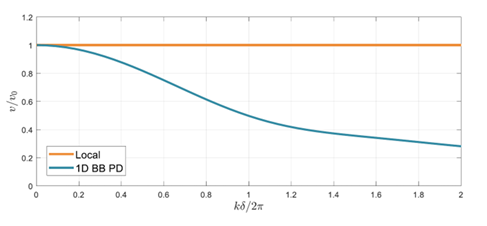
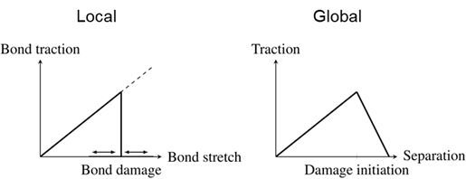
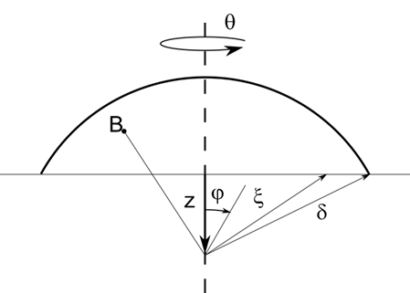

## Seminar 3: Convergence and fracture
**Convergence**

For FEM an error estimation is given bei [Zienkiewicz2013](@cite)

$$e=Ch^p$$
| Parameter | Defintion|
|--|--|
|$e$| error|
|$h$| mesh size ($h<1$)|
|$C$| constant|
|$p$| polynomial order|


$h\rightarrow 0$ leads to $e\rightarrow 0$; if analytical solutions exist

!!! info "Limitions"
    If the fundamental assumptions of classical continuum mechanics are violated, e.g. second derivative of $u$ exists.

**Peridynamics**


Figure taken from [BobaruF2016](@cite)




Figure taken from [PernatiiA2024](@cite)


## Damage models

$$\rho \ddot{u}_i = \frac{1}{2}\sum_j \mu_{ij}(f_{ji}V_i-f_{ij}V_j)+b_i$$

$$\mu_{ij}=\begin{cases}
  1 & \text{if undamaged}  \\
  0 & \text{if damaged}
\end{cases}$$




## Critical stretch
The critical stretch model is widely used in literature [BobaruF2016](@cite), [MadenciE2014](@cite). It defines the critical length change, or stretch $s$ as a criterion for a damage.

Herleitung Bednarek

$$s_{crit}\leq s \frac{| \underline{\mathbf{Y}} |}{| \underline{\mathbf{X}} |}$$

$$s_{crit} = \sqrt{\frac{G_{0C}}{[3G+(\frac{3}{4})^4(K-\frac{5G}{3})]\delta}}$$

## Critical energy

The critical energy model introduced by [FosterJT2011](@cite) is valid for state-based peridynamic and bond-based analysis.
The bond energy is defined as:

$$w_{bond} = \int_{\boldsymbol{\eta}_{final}} (\mathbf{\underline{T}}[x,t]\langle x'-x\rangle - \mathbf{\underline{T}}[x',t]\langle x-x'\rangle)d\boldsymbol{\eta}$$

with the relative displacement vector as:

$$\boldsymbol{\eta}=\mathbf{\underline{u}}[x',t]-\mathbf{\underline{u}}[x,t]$$

If the bond energy is bigger than or equal to the critical energy value, then the bond is considered to be broken:

$$w_{crit} \leq w_{bond}$$

The critical bond energy can be defined as:

$$w_{crit} = \frac{4G_{0C}}{\pi\delta^4}$$



$$w_{crit}=2\int_0^{\delta}\int_{\mathcal{H}}w_cdV=\int_0^{\delta}\int_{0}^{2\pi}\int_z^{\delta}\int_0^{\cos^{-1}z/\xi}w_c\xi^2\sin\phi d\phi d\xi d\omega dz$$

Equations are taken from [WillbergC2019](@cite).

---

## Differences
- discussion in the seminar
    - direction
    - experimental

---
# Numerical integration

**Integration of damage model**

```Julia
## Code concept

#Run material
#Evaluate Damage
#Run Material

omega = ones(length(nodes), nneighbor)


for idt in time

    K = create_K(omega)

    u = inv(K)*F_V # or from time integration

    for iID in nodes
        for jID in nlist[iID]
            s = (u[iID]+x[iID]-(u[jID]+x[jID]))/(x[jID]-x[iID])
            if  s>s_crit
                omega[i,j]=0
            end
        end
    end

    K = create_K(omega)

    u = inv(K)*F_V # or from time integration

    ...
end
```


```julia
using LinearAlgebra


function K_stiff(np, c, omega, V)
    K=zeros(np,np)
    for iID in 1:np
        for jID in -nn:nn
            if jID != 0 && iID + jID > 0 && iID + jID < np + 1
                xi = L*abs(jID)
                K[iID, iID + jID] -= 0.5 * c[iID] / xi * V * omega[iID, iID + jID]
                K[iID, iID]      +=  0.5 *c[iID] / xi * V * omega[iID, iID + jID]
            end
        end
    end
    K[np, :] = 0
    K[:, np] = 0
    K[np, np] = 1
    return K
end

E = 1
V = 1
L = 1
np = 8
nn = 2
delta = 1
u[1]=0.125
omega=ones(np, np)
u = zeros(np)

##
c=zeros(np)
c .= 2*E/delta^2
c[4]=1.5 .*c[4]

K_undam = K_stiff(np, c, omega, V)
omega[1,2] = 0
K_d = K_stiff(np, c, omega, V)
omega[2,1] = 0
K_dsym = K_stiff(np, c, omega, V)
omega[1,3] = 0
K_full_dam = K_stiff(np, c, omega, V)

## Damage


M = ["no damage" "damage" "damage sym" "damage full";K_undam*u K_d*u K_dsym*u K_full_dam*u]
display(M)
#--------------------------
println("Rank")
M = ["no damage" "damage" "damage sym" "damage full";
rank(K_undam) rank(K_d) rank(K_dsym) rank(K_full_dam)]
display(M)

```

**Discussion**

- How many bonds are allowed to break per time step?
- Size of the horizon?
