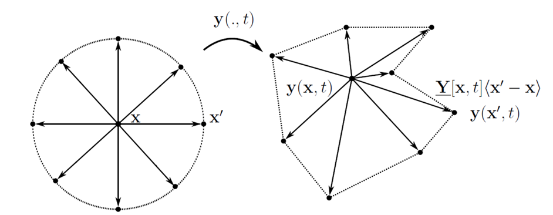

## Seminar 4: From bond-based to state-based I (Theory)

**Definition of states**

- A state is not in general a linear function of $\xi$ .
- A state is not in general a continuous function of $\xi$.
- The real Euclidean space $V$ is infinite-dimensional, while the real Euclidean space $\mathcal{L}_2$ (the set of second order tensors) has dimension 9

**Definitions**

*scalar state*

$\underline{a}\langle \boldsymbol{\xi}\rangle$

*vector state*

$\underline{\mathbf{A}}\langle \boldsymbol{\xi}\rangle$

*Shape tensor*

$$\mathbf{K} = \underline{\mathbf{X}}*\underline{\mathbf{X}} = \int_{\mathcal{H}}\underline{\omega}\langle \boldsymbol{\xi}\rangle\underline{\mathbf{X}}\langle \boldsymbol{\xi}\rangle\otimes\underline{\mathbf{X}}\langle \boldsymbol{\xi}\rangle dV$$

- is positive definite

Figure taken from [SillingSA2007](@cite)

## Constitutive Models

$$\boldsymbol{\xi} = \mathbf{x}'-\mathbf{x}$$

*Deformation vector state field*

$$\underline{\mathbf{Y}}[\mathbf{x},t]\langle \boldsymbol{\xi}\rangle=\mathbf{y}(\mathbf{x}+\boldsymbol{\xi},t)-\mathbf{y}(\mathbf{x},t)$$

A material is *elastic* if there exists a differentiable scalar valued
function $W(·) : \mathcal{V} \rightarrow \mathbb{R}$ such that

$$\underline{\mathbf{T}}= \hat{\underline{\mathbf{T}}}(\underline{\mathbf{Y}})= \nabla W(\underline{\mathbf{Y}})$$

$W$ is the strain energy density function.

## Ordinary state-based

Ordinary and elastic means
- It is mobile
- There exists a scalar-valued function $w$
$$W(\underline{\mathbf{Y}})= w(\underline{y})\qquad\text{and}\qquad \underline{y}=|\underline{\mathbf{Y}}$$
- For this $w$
$$\underline{t}(\underline{y})= \nabla w(\underline{y})$$

## PD solid elastic

Concept uses *Lamé coefficients*
$$\boldsymbol{\sigma} = 2G\boldsymbol{\varepsilon} + K \; \operatorname{tr}(\boldsymbol{\varepsilon}) I$$

$$\underline{e}\langle\boldsymbol{\xi}\rangle=|\mathbf{F}\boldsymbol{\xi}| - |\boldsymbol{\xi}|=\varepsilon_{ij}\frac{\xi_i\xi_j}{|\boldsymbol{\xi}|}$$

$$\varepsilon_{ij}=\frac12(u_{i,j}+u_{j,i})$$

$$\underline{e}^d\langle\boldsymbol{\xi}\rangle=\varepsilon_{ij}^d\frac{\xi_i\xi_j}{|\boldsymbol{\xi}|}$$
$$W=\frac{\alpha}{2}\int_{\mathcal{H}}\underline{\omega}\langle\boldsymbol{\xi}\rangle(\underline{e}^d\langle\boldsymbol{\xi}\rangle)^2dV_{\boldsymbol{\xi}}$$

under assumption of a spherical non-local domain.

$$W = \frac{\alpha m}{15}\varepsilon_{ij}^d\varepsilon_{ij}^d$$

compared with the strain energy density of the classical model.

$$\Omega=G\varepsilon_{ij}^d\varepsilon_{ij}^d$$

$$\alpha=\frac{15G}{m}$$

---

$$\underline{x}=|\underline{\mathbf{X}}|=|\boldsymbol{\xi}|\quad\underline{y}=|\underline{\mathbf{Y}}|$$

$$\underline{e}=\underline{y}-\underline{x}=|\boldsymbol{\eta}|$$

$$\underline{y}-\underline{x}\neq|\boldsymbol{\eta}|$$
$$\underline{t}=|\underline{\mathbf{T}}|$$

**Weighted volume**

$$m_V = \int_{\mathcal{H}} \underline{\omega}\langle \boldsymbol{\xi}\rangle \underline{x} \underline{x} dV$$

**Dilatation**

$$\theta = \frac{3}{m_V} = \int_{\mathcal{H}}\underline{\omega}\langle \boldsymbol{\xi}\rangle \underline{x} \underline{e}\langle \boldsymbol{\xi}\rangle dV$$

$$\underline{t} = \frac{\omega\langle \boldsymbol{\xi}\rangle }{m_V}\left[3K \theta \underline{x} + 15G \underline{e}^d  \right]$$

*Decomposition in the devatoring and isotropic part of the strain*

$$\underline{e}^d\langle \boldsymbol{\xi}\rangle = \epsilon_{ij}^d\xi_i\frac{x_j}{|\boldsymbol{\xi}|}$$

$$\underline{e}^i\langle \boldsymbol{\xi}\rangle = \epsilon_{ij}^i\xi_i\frac{x_j}{|\boldsymbol{\xi}|}$$

The force density can be determined as

$$\underline{\mathbf{T}}=\underline{t}\frac{\underline{\mathbf{Y}}}{|\underline{\mathbf{Y}}|}$$

## Correspondence
$$\mathbf{F}=\int_{\mathcal{H}}(\underline{\omega}\langle \boldsymbol{\xi}\rangle\underline{\mathbf{Y}}\langle \boldsymbol{\xi}\rangle\otimes\underline{\mathbf{X}}\langle \boldsymbol{\xi}\rangle dV )\cdot \mathbf{K}^{-1}$$

$$\mathbf{K}=\int_{\mathcal{H}}\underline{\omega}\langle \boldsymbol{\xi}\rangle\underline{\mathbf{X}}\langle \boldsymbol{\xi}\rangle\otimes\underline{\mathbf{X}}\langle \boldsymbol{\xi}\rangle dV$$

$$\boldsymbol{\sigma} = f(\mathbf{F}, t, T, ...)$$

$$\mathbf{P} = \text{det}(\mathbf{F})\boldsymbol{\sigma}\mathbf{F}^{-T}$$

$$\underline{\mathbf{T}} = \underline{\omega}\langle \boldsymbol{\xi}\rangle\mathbf{P}\mathbf{K}^{-1}\mathbf{\xi}$$

## Zero-energy modes

For correspondence models, the so called zero-energy modes could occur [TupekMR2014](@cite). These modes are non-physical and lead to unstable or unreasonable solutions. Several stabilization methods were published to overcome this problem [BreitenfeldMS2014](@cite), [ChenH2018](@cite), [LiP2018](@cite), [TupekMR2014b](@cite),[WuCT2014](@cite),[WuCT2015](@cite).

$$\underline{\mathbf{T}}^C=\underline{\mathbf{T}}+\underline{\mathbf{T}}^S$$

$$\underline{\mathbf{T}}^S\langle \boldsymbol{\xi}\rangle = \underline{\omega}\langle\boldsymbol{\xi}\rangle\mathbf{C}_1\underline{\mathbf{z}}$$

$$\underline{\mathbf{z}}\langle \boldsymbol{\xi}\rangle= \underline{\mathbf{Y}}\langle\boldsymbol{\xi} \rangle-\mathbf{F}\boldsymbol{\xi}$$

$$\mathbf{C}_1=\mathbf{C}\cdot\cdot\mathbf{K}^{-1}$$
