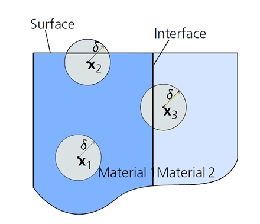

# Surface correction
There are several ways to deal with the surface correction in Peridynamics. The issue is caused, because parts of the intergral domain $\mathcal{H}$ near a surface lies outside of the material or is mixed between materials (shown in the figure). This leads to errors in the computation of the force densities. For smaller horizons, obviously this effect can be reduced. However, there are several methods to mitigate the issue described in this study [LeQV2018](@cite).

## Volume correction
Following the study of Le and Bobaru

!!! info "Quote [LeQV2018](@cite)"
    the simplest correction methods to implement, the volume correction method, also appear to be one of the most effective. Correction methods reduce the PD surface effect faster (more efficiently) than simply using a smaller horizon (problem shown in the figure).

a volume corrections factor $\lambda_{corr}$ is introduced deviding the domain volume $V_0$ by the avarage of the domain volumes of point  $\mathbf{x}$ and $\mathbf{x}'$.

$$\lambda_{corr}=\frac{2V_0}{V(\mathbf{x})+V(\mathbf{x}')}$$

The reference volumen $V_0$ is depended on the dimension (3D or 2D)

$$V_{0-3D}=\frac{4\pi\delta^3}{3}$$

$$V_{0-2D}=\frac{\pi\delta^2h}{4}$$

this factor is than multiplied to the bond force
$$\mathbf{t}_{corr} =\lambda_{corr}\mathbf{t}$$

!!! warn "Only mechanical"
    Surface correction is right now only applied for mechanical properties.

You can apply the surface correction initialy for all outer surfaces and continuous, for cracks or additive manufacturing.
